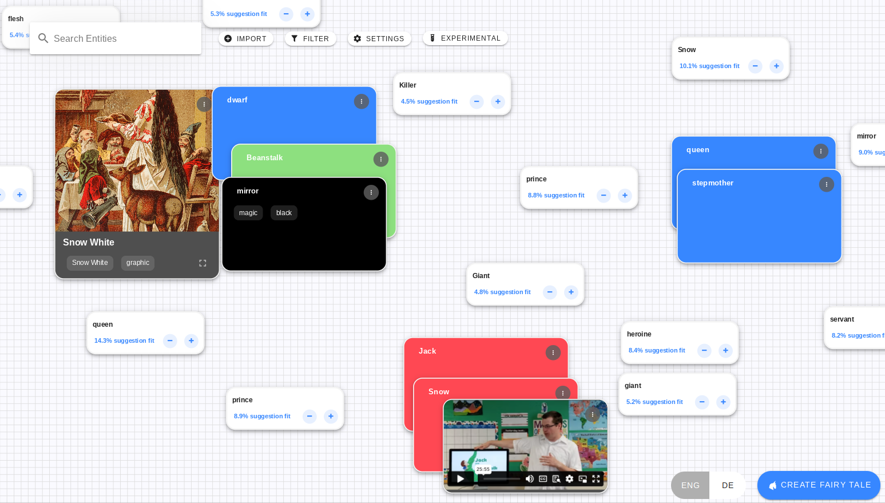
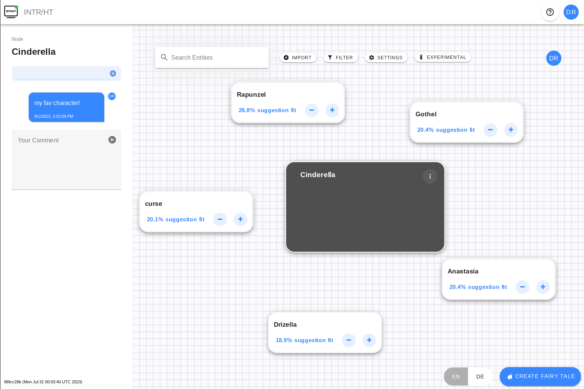
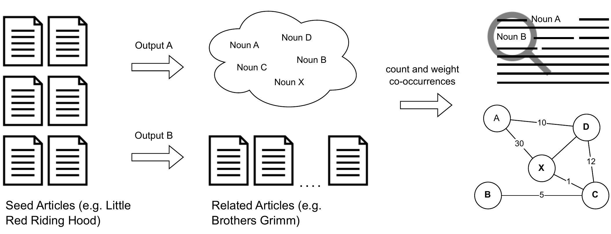
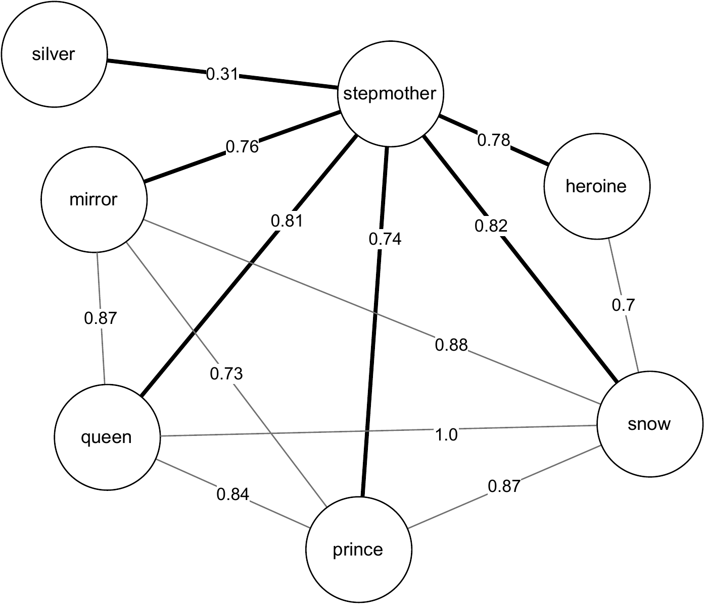
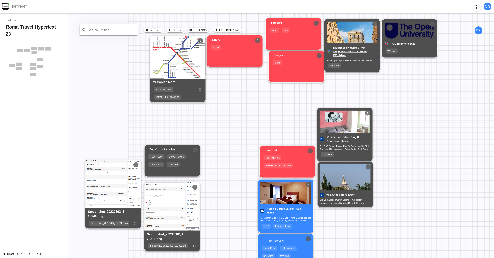

# SPORE: A Storybreaking Machine

- Read the paper here: [ACM DL](https://doi.org/10.1145/3603163.3609075)
- Visit the application here: [SPORE](https://human.iisys.de/nxtweb) (registration is open, no real mail needed, use the token "hypertext", laptop or tablet recommended)

Keywords: 
 - hypertext
 - spatial hypertext
 - recommender system
 - linguistics
 - storytelling
 - tropes

## Abstract
We want to present SPORE, a Spatial Recommender System. As we
enter a period of unprecedented collaboration between authors and
computers, where artificial intelligence in particular seems likely to
act increasingly in a co-authoring capacity, SPORE offers a different
approach to collaboration. More organic and exploratory than other
automated or procedural systems, SPORE aims to mimic the process
of storybreaking that already exists in the creative industries.

## Demo

SPORE allows its users to add tropes, names, or other ideas to a 2D space. If the system is already
aware of the concept, it gives and composes recommendations in the space. In the following image, the user added
"Cinderella".

The application is collaborative, and can be used by multiple users simultaneously. On the left hand side resides the info bar, where users cann add tags and comments to concept.

Recommendations can be replaced with others, or can be accepted by hitting the '+'-Button. They become part
of the user-controlled concepts and can be re-arranged by the user.

<video src='video_add.mp4' width="100%" loop controls autoplay></video>

Which recommendations are shown and how they are composed is to a large extend controlled by a visual parser.
A software module that interprets human-generated visual structure. If the parser detects groups of objects
which belong together visually (by color, position, etc) it issues a query to a knowledge base and receives 
recommendations.

<video src='video_more.mp4' width="100%" loop controls autoplay></video>

While takling about 'knowledge bases'. For this demo we used a versatile algorithm to mine Wikipedia sources.
For details, give the [paper (6 pages)](https://doi.org/10.1145/3603163.3609075) a read! :) The follwing image
gives an overview..

.. or checkout a sample excpert for 'stepmother':

    

What's next? Users (authors) may (collaboratively) craft story pieces within the space. The system provides them recommendations to
foster the creative process, probably triggering serendipity. Furthermore, the results of the ongoing visual parsing are used
to improve the knowledge base. Fun story:

> We demoed the system to children. One of them added "seven-headed dragon" to the workspace, thus as part of the story. The system
"learned" that concept and connected it to other concepts that where visually related. This way, other children which were testing
the system afterwards added this dragon to their story as well, because it was a recommendation.

What would a demo be, without any AI? Of course we did. On the lower right, the application offers a button to "create a fairy tale".
This sends the content of the workspace, along with its parsed visual structure and a specific instruction to ChatGPT. It is primed
to create fairy tales with a happy ending and a positive message. The next video shows a small sample ([read the result here](https://human.iisys.de/liten/get/story?storyid=870b233a-ef90-449a-8906-29b97fab7889))

<video src='video_create.mp4' width="100%" loop controls autoplay></video>

## Other Use Cases

e.g. plan your trip to the best conference:

or browse a knowledge base about scientific (hypertext) literature:

