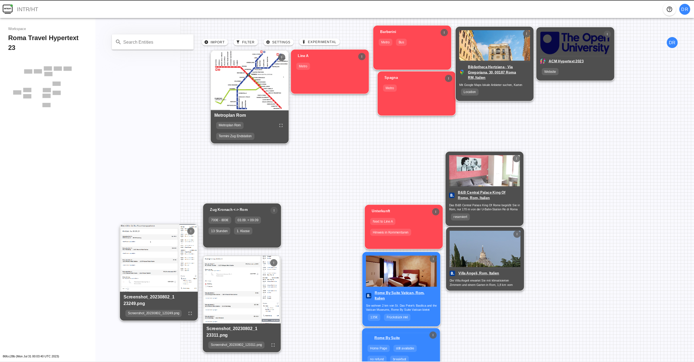

# SPORE: A Storybreaking Machine

Read the paper here: [ACM DL](https://doi.org/10.1145/3603163.3609075)

Keywords: 
 - hypertext
 - spatial hypertext
 - recommender system
 - linguistics
 - storytelling
 - tropes

## Abstract
We want to present SPORE, a Spatial Recommender System. As we
enter a period of unprecedented collaboration between authors and
computers, where artificial intelligence in particular seems likely to
act increasingly in a co-authoring capacity, SPORE offers a different
approach to collaboration. More organic and exploratory than other
automated or procedural systems, SPORE aims to mimic the process
of storybreaking that already exists in the creative industries.

## Demo

SPORE allows its users to add tropes, names, or other ideas to a 2D space. If the system is already
aware of the concept, it gives and composes recommendations in the space. In the following image, the user added
"Cinderella".

The application is collaborative, and can be used by multiple users simultaneously. On the left hand side resides the info bar, where users cann add tags and comments to concept.

Recommendations can be replaced with others, or can be accepted by hitting the '+'-Button. They become part
of the user-controlled concepts and can be re-arranged by the user.

<video src='video_add.mp4' width="100%" loop controls autoplay></video>

